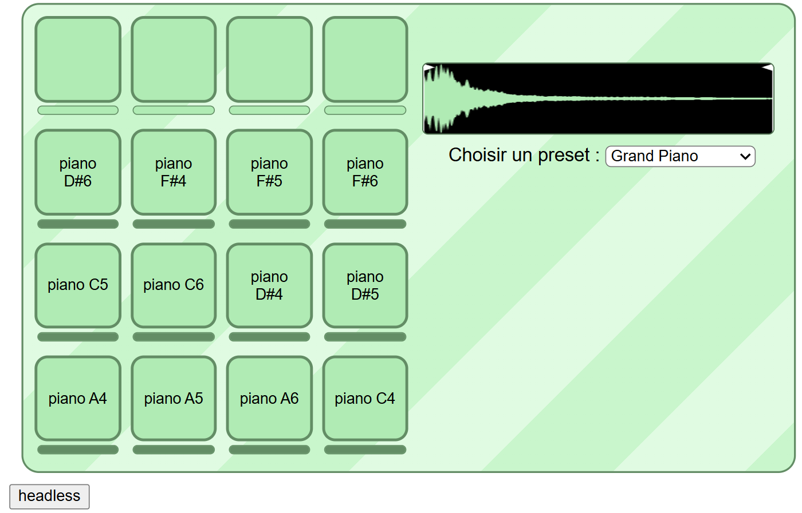

# WebAudioSampler  
  
Mathis ANDRÉ  

<p align="center"></p>  
  
Un sampler audio qui utilise une api pour récupérer les sons  

  
## Fonctionnalités  
  
- Choix des presets via l'api
- Wave form qui permet de voir les ondes sonores    
- Trim bars qui permettent de contrôler la longueur de chaque son  
- Possibilité d'interagir avec le pad via les touches de clavier (1234  AZER  QSDF  WXCV)  
- Bouton pour charger un preset et jouer un son sans interface graphique

## Utilisation  

Pour utiliser le projet, il faut lancer le serveur avec node.js puis lancer le client avec Live Server

#### Instalation  
Installer les dépendances  
```
$ cd server
$ npm i
``` 

#### Lancer le serveur  
Lancer le serveur avec node.js  
```
$ cd server
$ npm run dev
``` 

#### Lancer le client  
Ouvrir client\src\index.html avec Live Server  